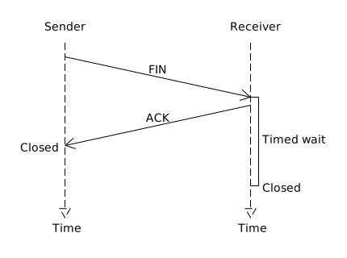

# Background
## Reliable Data Transfer
- **MSS (maximum segment size)** is the maximum amount of application-layer data in the segment.
- MSS is typically set by first determining the length of the largest link-layer frame that can be sent by the local sending host, the so-called, **MTU(maximum transmission unit)**.
- When sends a large file, it typically breaks the file into chunks of size MSS.
- The **sequence number** for a segment is therefore the byte-stream number of the first byte in the segment.
- It randomly choose an initial sequence number.
- The **acknowledgment number** that receiver puts in its segment is the sequence number of the next byte expected from sender.
- Only acknowledges bytes up to the first missing byte in the stream, which is said to provide **cumulative acknowledgments**.
- **Selective acknowledgment**, allows receiver to acknowledge out-of-order segments selectively rather than just cumulatively acknowledging the last correctly received, inorder segment.
- **RTT** (round-trip time), which is the time it takes for a small packet to travel from sender to receiver and then back to the sender.
- **SampleRTT**, for a segment is the amount of time between when the segment is sent (that is, passed to IP) and when an acknowledgment for the segment is received. The SampleRTT is being estimated for only one of the transmitted (except a segment that has been retransmitted) but currently unacknowledged segments, leading to a new value of SampleRTT approximately once every RTT.
- **EWMA (exponential weighted moving average)** of EstimatedRTT:  
```EstimatedRTT = 0.875 • EstimatedRTT + 0.125 • SampleRTT```
- RTT variation, **DevRTT**:  
```DevRTT = 0.75 • DevRTT + 0.25 • | SampleRTT – EstimatedRTT |```
- Determines the retransmission **timeout interval**:  
```TimeoutInterval = EstimatedRTT + 4 • DevRTT```
- An initial TimeoutInterval value of 1 second is recommended.
- Each time TCP retransmits, it sets the next timeout interval to twice the previous value.
- Simplified TCP sender:
    ```c
    /* Assume sender is not constrained by TCP flow or congestion control, that data from above is less
    than MSS in size, and that data transfer is in one direction only. */

    NextSeqNum=InitialSeqNumber
    SendBase=InitialSeqNumber

    loop (forever) {
        switch(event)

            event: data received from application above
                create TCP segment with sequence number NextSeqNum
                if (timer currently not running)
                    start timer
                pass segment to IP
                NextSeqNum=NextSeqNum+length(data)
                break;
                
            event: timer timeout
                retransmit not-yet-acknowledged segment with
                    smallest sequence number
                start timer
                break;
            
            event: ACK received, with ACK field value of y
                if (y > SendBase) {
                    SendBase=y
                    if (there are currently any not yet
                        acknowledged segments)
                        start timer
                }
                else { /* a duplicate ACK for already ACKed
                    segment */
                    increment number of duplicate ACKs
                        received for y
                    if (number of duplicate ACKS received
                        for y==3)
                        /* TCP fast retransmit */
                        resend segment with sequence number y
                }
                break;
        
    } /* end of loop forever */
    ```
## Flow Control
- Sender maintains a variable called the **receive window**, denoted **rwnd**. Informally, the receive window is used to give the sender an idea of how much free buffer space is available at the receiver:  
```rwnd = RcvBuffer – [LastByteRcvd – LastByteRead]```
- Receiver places its current value of rwnd in the receive window field of every segment it sends to sender.
- Sender make sure that:  
```LastByteSent – LastByteAcked ≦ rwnd```
- When receiver's receive buffer becomes full so that rwnd = 0, to avoid sender being blocked, it requires sender to continue to send segments with one data byte. These segments will be acknowledged by the receiver. Eventually the buffer will begin to empty and the acknowledgments will contain a nonzero rwnd value.
## Connection Management
- TCP three-way handshake: segment exchange:  

- Closing a TCP connection:   

## Our Adapted Connection Close

## Congestion Control
- Sender keeps track of an variable, the **congestion window**, denoted **cwnd**, imposes a constraint on the rate at which a TCP sender can send traffic into the network, roughly **cwnd/RTT bytes/sec**.
- FSM description of congestion control:  

## The Client-Server Application using TCP

## TCP Segment Structure

## Our Adapted Header Structure
<table>
   <tr>
      <td align="center" colspan="4">32 bits</td>
   </tr>
   <tr>
      <td align="center" colspan="4">Sequence number</td>
   </tr>
   <tr>
      <td align="center" colspan="4">Acknowledgement number</td>
   </tr>
   <tr>
      <td align="center" colspan="1">ACK</td>
      <td align="center" colspan="1">SF(SYN=1, FIN=2)</td>
      <td align="center" colspan="2">Receive window</td>
   </tr>
</table>