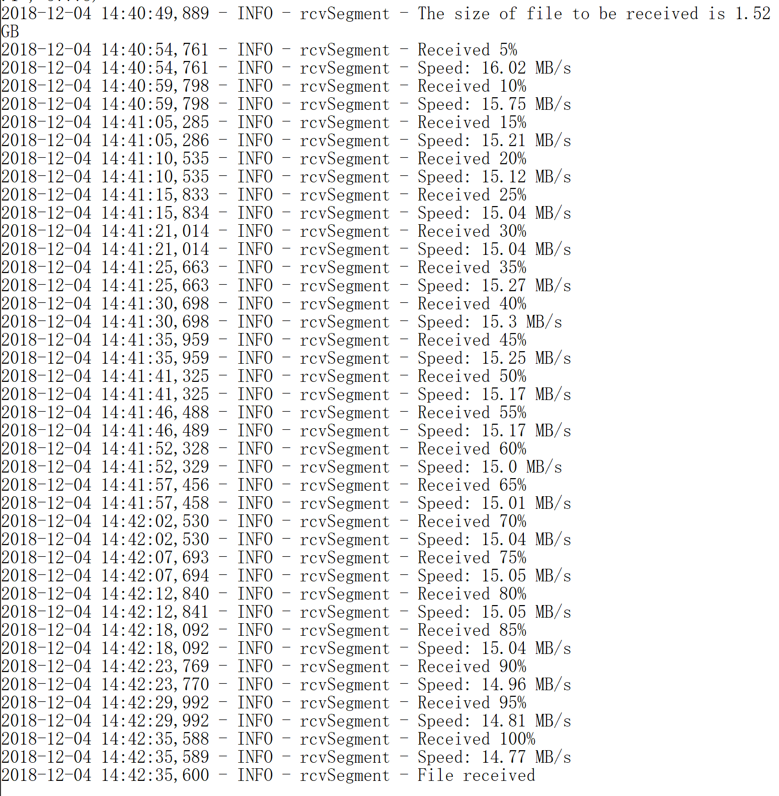
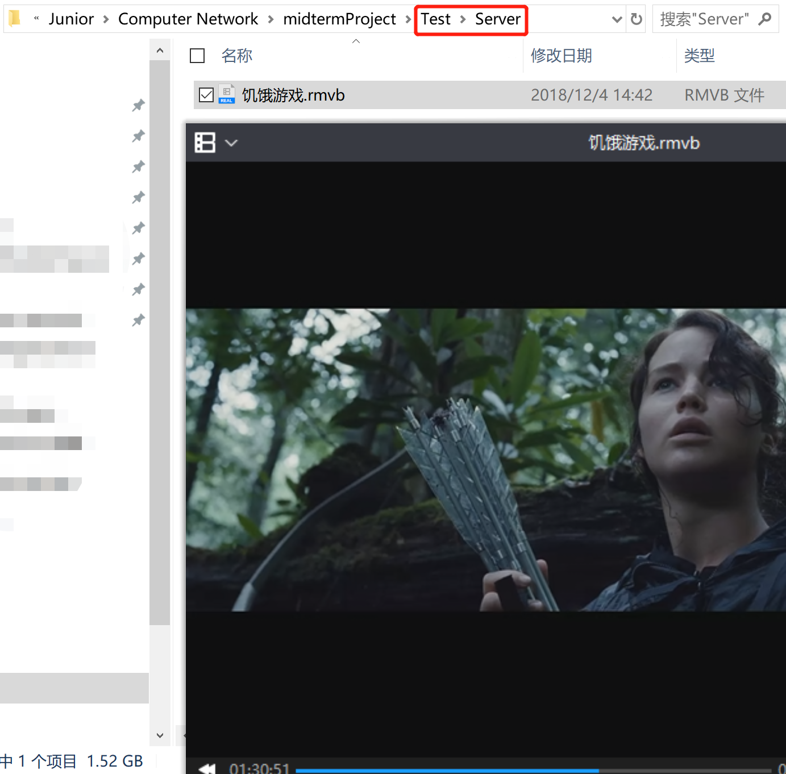
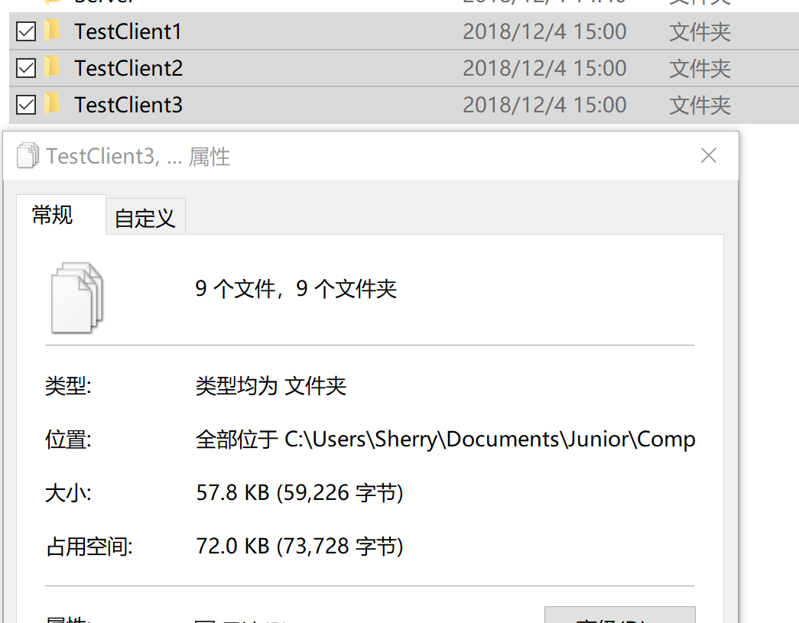

# Test Documentation

## Readme

- Environment:
  -  `Windows Ubuntu 18.04 bash ` (**cannot execute directly in windows 10 CMD**) 
  - `Mac?`

- In single machine test, you should make new directory.

  ```shell
  # mkdir Test 
  # mkdir Test/Server
  # mkdir Test/Client
  ```

  > put the file you would like to send to the server in the `Client` while put those you would like to get from the server in `Server`

- The format of input in the command line of server side is:

  ```shell
  # ./server.py
  ```

  That of client side is:

  ```shell
  #  ./client.py {lsend, lget}  servername:serverport myLargeFileName
  ```

## Single Machine Test

Run the server at first:


### `lsend`

#### Client Side

In this test case, we try to transfer the movie, *The Hunger Games*, using the command `./client.py lsend 127.0.0.1:16666 FILENAME`

##### If file does not exist


##### File sent normally

In the client side, logs of debugging message of LFTP is as follows, including the process of `establishing connection`, `progress message`, `the change of congestion status`, `the change of RTT`, `the sequence number of the packet retransmitted`. 


#### Server Side

In the server side, in other words, receiving side, the output message includes the progress messages and average speed in each 5% progress. 



when finishing receiving the file, the file can play. 



### `lget`

> This is a test for multi-users

In `lget` command, two sides act in the same way but their roles exchange. 

To test multi-users, we create 3 directories, each of which includes the sub directory `Test/Client` to receive the file from the server and necessary python programs (`client.py`, `UDPClient.py`, `UDPServer.py`).



During the file transferring process, compared with single user mode, 3 client divides the speed averagely. 


After they finishing receiving the file, the content in the directories is as follows:


And all of received file can be executed well, guaranteeing the 100% reliability. 

## Test on the Server
