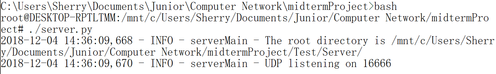
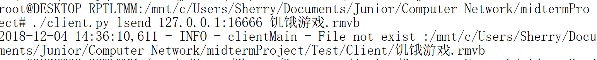
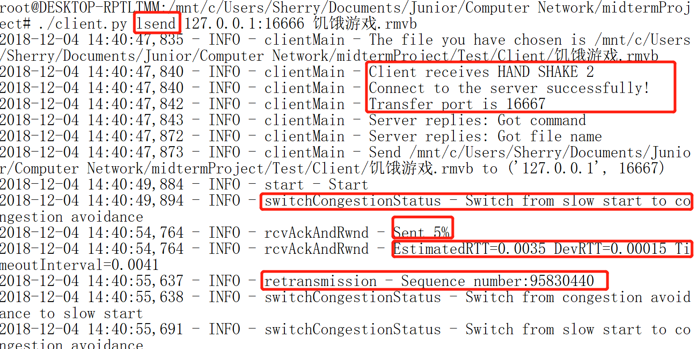
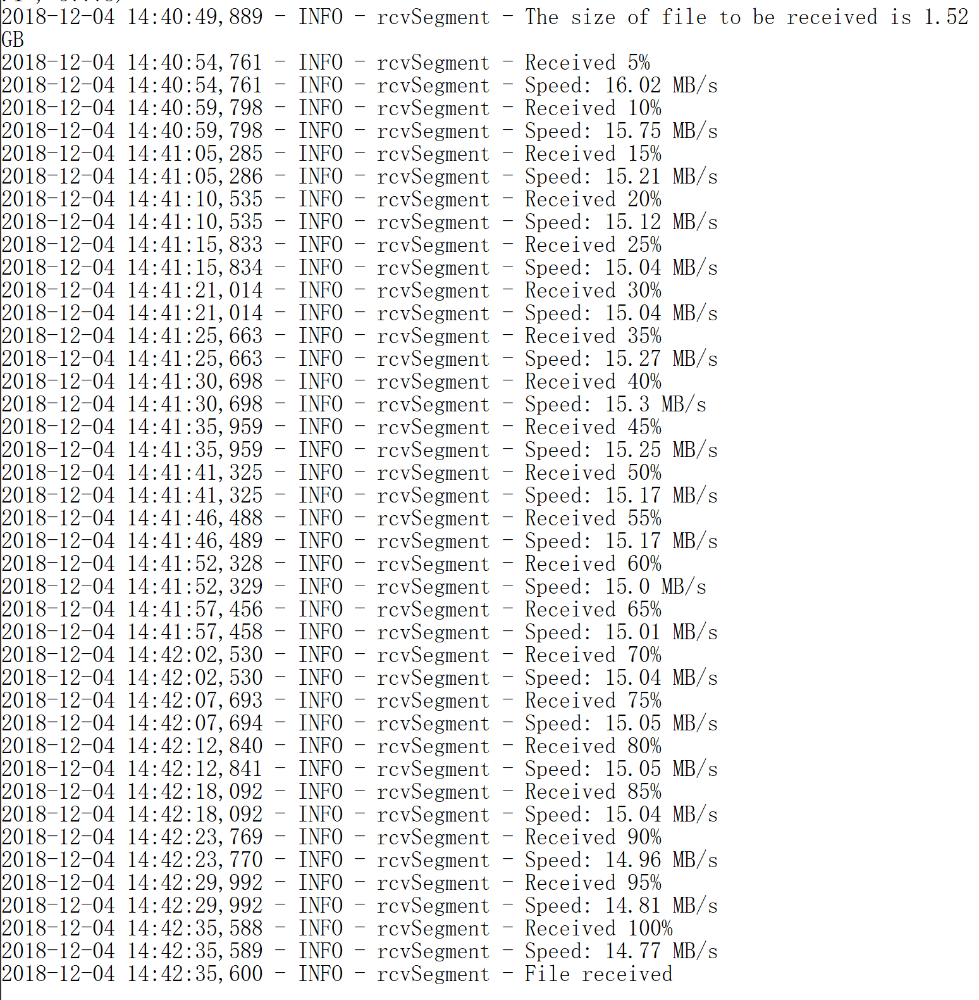
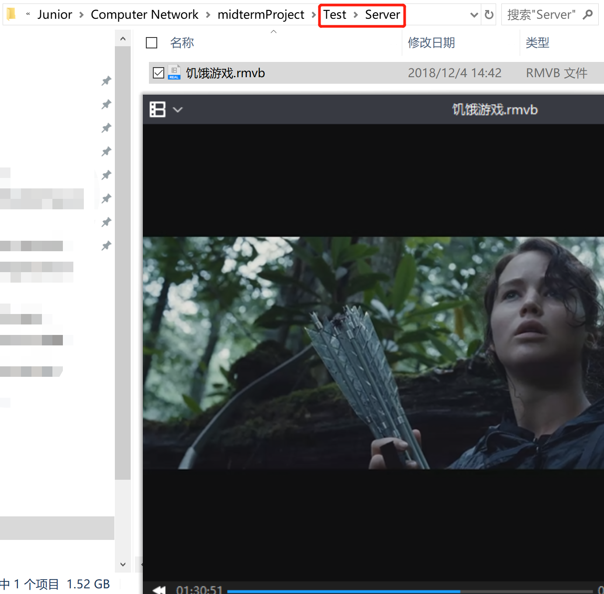
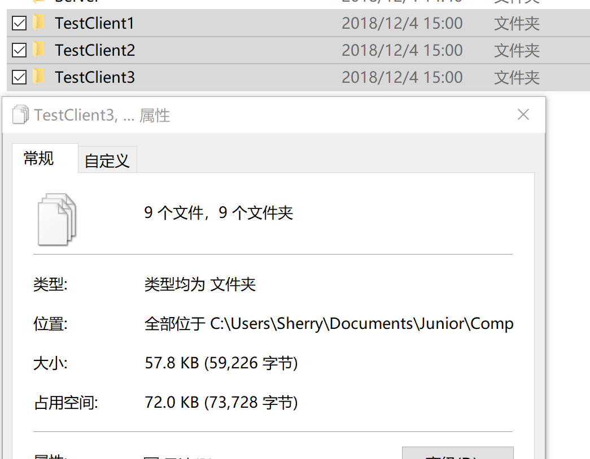
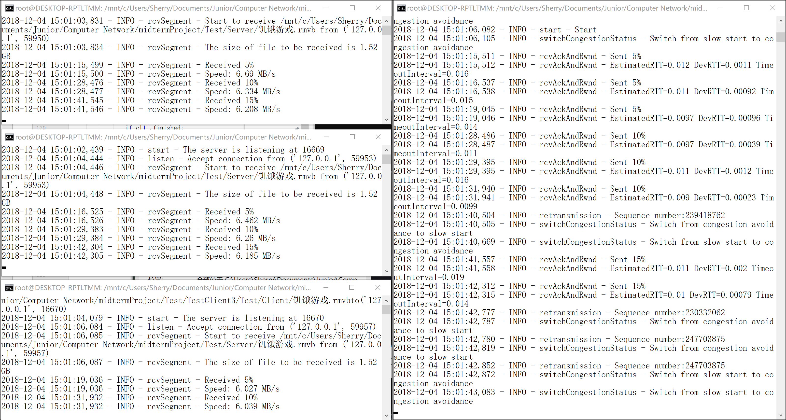
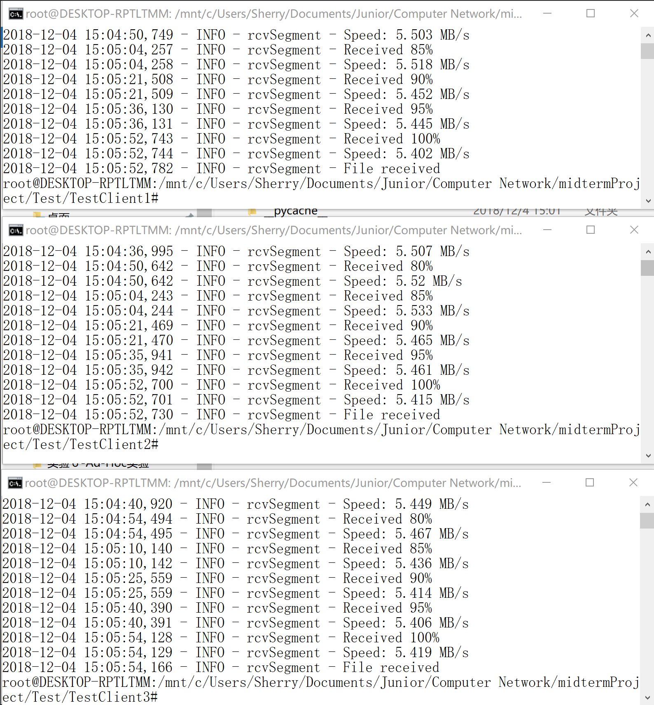
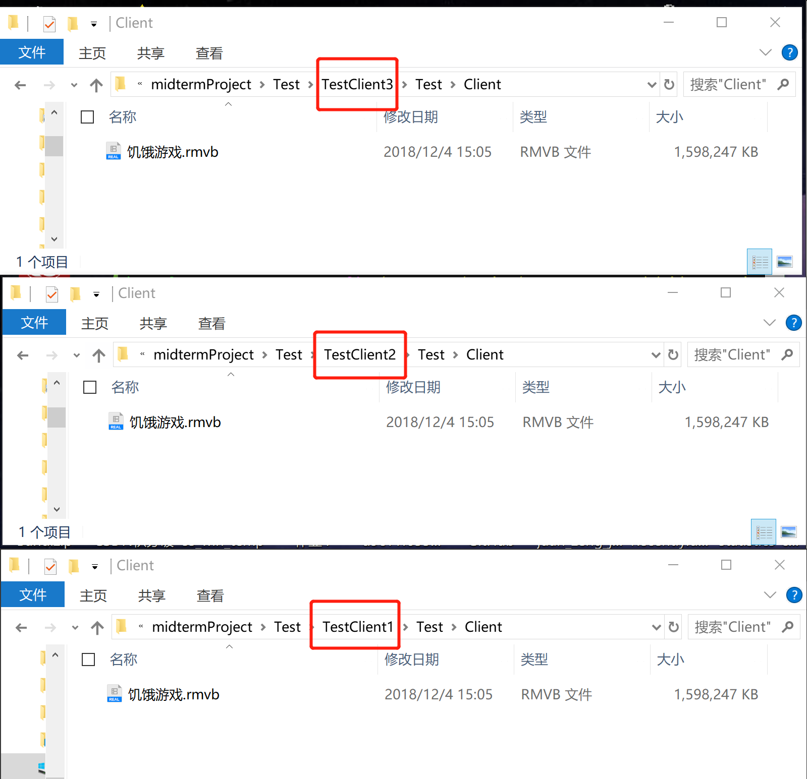

<p align="center">
  
  <p align="center">
    UDP file transfer providing reliability, flow control and congestion control
  </p>
</p>

# Introduction
We develop a novel network application to support large file transfer between two computers in the Internet, which is illuminating for using **UDP** as the transport layer protocol but anyway providing 100% **reliability**, **flow control** function and **congestion control** function similar as **TCP**. Furthermore, our application support multiple clients at the same time.
# Related Work

Generally, we observe the design of TCP protocol. However, we notes several parts that are slightly different from the standard TCP. 

## Standard Reliable Data Transfer
- **MSS (maximum segment size)** is the maximum amount of application-layer data in the segment.

- MSS is typically set by first determining the length of the largest link-layer frame that can be sent by the local sending host, the so-called, **MTU(maximum transmission unit)**.

- When sends a large file, it typically breaks the file into chunks of size MSS.

- The **sequence number** for a segment is therefore the byte-stream number of the first byte in the segment.

- It randomly choose an initial sequence number.

- The **acknowledgment number** that receiver puts in its segment is the sequence number of the next byte expected from sender.

- Only acknowledges bytes up to the first missing byte in the stream, which is said to provide **cumulative acknowledgments**.

- **Selective acknowledgment**, allows receiver to acknowledge out-of-order segments selectively rather than just cumulatively acknowledging the last correctly received, inorder segment.

- **RTT** (round-trip time), which is the time it takes for a small packet to travel from sender to receiver and then back to the sender.

- **SampleRTT**, for a segment is the amount of time between when the segment is sent (that is, passed to IP) and when an acknowledgment for the segment is received. The SampleRTT is being estimated for only one of the transmitted (except a segment that has been retransmitted) but currently unacknowledged segments, leading to a new value of SampleRTT approximately once every RTT.

- **EWMA (exponential weighted moving average)** of EstimatedRTT:  

  ```EstimatedRTT = 0.875 • EstimatedRTT + 0.125 • SampleRTT```

- RTT variation, **DevRTT**: 

  ```DevRTT = 0.75 • DevRTT + 0.25 • | SampleRTT – EstimatedRTT |```

- Determines the retransmission **timeout interval**:  

  ```TimeoutInterval = EstimatedRTT + 4 • DevRTT```

- An initial TimeoutInterval value of 1 second is recommended.

- Each time TCP retransmits, it sets the next timeout interval to twice the previous value.

- Simplified TCP sender:
    ```c
    /* Assume sender is not constrained by TCP flow or congestion control, that data from above is less
    than MSS in size, and that data transfer is in one direction only. */
    
    NextSeqNum=InitialSeqNumber
    SendBase=InitialSeqNumber
    
    loop (forever) {
        switch(event)
    
            event: data received from application above
                create TCP segment with sequence number NextSeqNum
                if (timer currently not running)
                    start timer
                pass segment to IP
                NextSeqNum=NextSeqNum+length(data)
                break;
                
            event: timer timeout
                retransmit not-yet-acknowledged segment with
                    smallest sequence number
                start timer
                break;
            
            event: ACK received, with ACK field value of y
                if (y > SendBase) {
                    SendBase=y
                    if (there are currently any not yet
                        acknowledged segments)
                        start timer
                }
                else { /* a duplicate ACK for already ACKed
                    segment */
                    increment number of duplicate ACKs
                        received for y
                    if (number of duplicate ACKS received
                        for y==3)
                        /* TCP fast retransmit */
                        resend segment with sequence number y
                }
                break;
        
    } /* end of loop forever */
    ```
## Standard Flow Control
- Sender maintains a variable called the **receive window**, denoted **rwnd**. Informally, the receive window is used to give the sender an idea of how much free buffer space is available at the receiver: 

  ```rwnd = RcvBuffer – [LastByteRcvd – LastByteRead]```

- Receiver places its current value of rwnd in the receive window field of every segment it sends to sender.

- Sender make sure that: 

  ```LastByteSent – LastByteAcked ≦ rwnd```

- When receiver's receive buffer becomes full so that rwnd = 0, to avoid sender being blocked, it requires sender to continue to send segments with one data byte. These segments will be acknowledged by the receiver. Eventually the buffer will begin to empty and the acknowledgments will contain a nonzero rwnd value.
## Standard Connection Management
- TCP three-way handshake: segment exchange:  

- Closing a TCP connection:   

## Our Adapted Connection Close

## Standard Congestion Control
- Sender keeps track of an variable, the **congestion window**, denoted **cwnd**, imposes a constraint on the rate at which a TCP sender can send traffic into the network, roughly **cwnd/RTT bytes/sec**.
- FSM description of congestion control:  

### Implementation of Congestion Control

- In our design, we neatly follow the FSM as above, receiving the events (init, new ACK, duplicate ACK, timeout) as parameters and judging the current status of congestion control. And then calling the `retransmission` function we have implemented when `timeout` or `duplicate ack` event happens.  And we change ssthresh, cwnd, congestion status and duplicateAck according to the FSM, outputing corresponding logs describing the change of congestion status. 
- To listen the events which will trigger these events, we judge some of them related to `ack` in `rcvAckAndRwnd` function which is a thread to deal with receiving packets, and the other related to timeout in `detectTimeout` function which is another thread to running all the time and judge whether the difference between the current time and startTime is more than the timeout interval (controlled by RTT).  
  - When the `ackNum` equals to `NextSeqNum`, `duplicate ack` happens.
  - When `ackNum` is more than `NextSeqNum`, `new ack` happens.
  - When `detectTimeout` thread detects a time out, `time out` event is triggered to switch the Congestion Status.

## Standard Client-Server Application using TCP


## Standard TCP Segment Structure

## Our Adapted Header Structure
<table>
   <tr>
      <td align="center" colspan="4">32 bits</td>
   </tr>
   <tr>
      <td align="center" colspan="4">Sequence number</td>
   </tr>
   <tr>
      <td align="center" colspan="4">Acknowledgement number</td>
   </tr>
   <tr>
      <td align="center" colspan="1">ACK</td>
      <td align="center" colspan="1">SF(SYN=1, FIN=2)</td>
      <td align="center" colspan="2">Receive window</td>
   </tr>
</table>

## Our Design of C-S Model

In the basic implementation of one client and one server model,(`UDPSender.py` and `UDPReceiver.py`) it satisfies that the client side and transmit a large file to the server side. And in one to one model, C and S can exchange their roles to make sure that the `server` can also transmit to the `client`, which is the process of "downing a file from a server".

And our support to  multiple client at the same time, we encapsulate another layer and add thread of top-layer server(`server.py`) side.

### Top-layer server side

The top-layer server side receives client packet including dealing with 3 handshakes in a while loop. When it receives "HAND SHAKE 3" from a client side, `userCount` adds up one and new thread to serve the client starts. 

> In the while loop, we use `rejudge` variable like a `lock` to wait for 3 HAND SHAKE in case some client only makes one hand shake.  

As for each client thread, we resolves the command to  filename, command(`lget`, `lsend`). 

- Firstly, the server will return a server port back to the client

- Secondly, it will judge the role of the server and call corresponding class. 

  - UDPReceiver.getFile for `lsend` command 
  - UDPSender.sendFile for `lget` command

- Thirdly, if the command is `lget`, the server will check whether the file exists in the `ROOT_DIR`. 

  > in our experiment, the root directory is `/Test/Server`  relative to the path of `server.py`

### Top-layer client side

In the top-layer client side, the first thing to do is splitting the input to command, dest_ip, dest_port and the name of the large file. 

Because one client runs a client program, there's no need for threads in top-layer client(but there's some in basic-layer client). 

There's four things to do for a client.

- Firstly, it should check whether the file to send exists in the directory. 

  > like in server side, the root directory is  `/Test/Client`  relative to the path of `client.py`

- Secondly, it will send handshake message to server according to the server address and server port assigned in the command line. And wait for 3 hand shake finishing and connection setting up.

- Thirdly, it will get the server port for transferring file instead of setting up connection. And then the client will send the file name to the server. 

- At last, it will judge the command and decide the role of client side, like in server

  - UDPSender.sendFile for `lsend`
  - UDPSender.getFile for `lget`

# Experiments
We conduct the following experiments to observe the behaviors and demonstrate the effectiveness of this program.

## Getting Started
Firstly, clone this repository on both client and server side and enter the cloned directory.  
```console
# git clone https://github.com/Ernie1/MoonTan.git
```
Secondly, create new directory.
- Client
    ```console
    # mkdir Test 
    # mkdir Test/Client
    ```
- Server
  ```console
  # mkdir Test 
  # mkdir Test/Server
  ```

Then, put the file you would like to send to the server in the `Client` while put those you would like to get from the server in `Server`.   

Now, run this program.

- The format of input in the command line of server side is:

  ```console
  # ./server.py
  ```

- That of client side is:

  ```console
  #  ./client.py {lsend, lget}  servername:serverport myLargeFileName
  ```

## Single Machine Experiment

### Environment
- `Windows Ubuntu 18.04 bash ` (**cannot execute directly in windows 10 CMD**) 

Run the server at first:



### `lsend`

#### Client Side

In this test case, we try to transfer the movie, *The Hunger Games*, using the command `./client.py lsend 127.0.0.1:16666 FILENAME`

##### If file does not exist



##### File sent normally

In the client side, logs of debugging message of LFTP is as follows, including the process of `establishing connection`, `progress message`, `the change of congestion status`, `the change of RTT`, `the sequence number of the packet retransmitted`. 



#### Server Side

In the server side, in other words, receiving side, the output message includes the progress messages and average speed in each 5% progress. 



when finishing receiving the file, the file can play. 



### `lget`

This is a test for **multi-users**.

In `lget` command, two sides act in the same way but their roles exchange. 

To test multi-users, we create 3 directories, each of which includes the sub directory `Test/Client` to receive the file from the server and necessary python programs (`client.py`, `UDPSender.py`, `UDPReceiver.py`).



During the file transferring process, compared with single user mode, 3 client divides the speed averagely. 





After they finishing receiving the file, the content in the directories is as follows:



And all of received file can be executed well, guaranteeing the 100% reliability. 

## Online Experiment
- Environment
  - Server - `Ubuntu 14.04.1` connects to optical fiber
  - Client - `macOS Mojave 10.14.1` connects to wireless 

We deploy the program in real network environment. We run the program on a public server and open two console windows on personal computer to create clients. Client 1 and Client 2 `lsend` files to server simultaneously. Each client `lget` file as soon as it finishes sending file.
- Client 1 `lsend`
    ```console
    Ernie1:src zjq$ python3 client.py lsend 222.200.180.151:16666 test1.mp4
    2018-12-04 17:59:31,462 - INFO - clientMain - The file you have chosen is /Users/zjq/LFTP/src/Test/Client/test1.mp4
    2018-12-04 17:59:31,465 - INFO - clientMain - Client receives HAND SHAKE 2
    2018-12-04 17:59:31,465 - INFO - clientMain - Connect to the server successfully!
    2018-12-04 17:59:31,468 - INFO - clientMain - Transfer port is 16667
    2018-12-04 17:59:31,471 - INFO - clientMain - Server replies: Got command
    2018-12-04 17:59:31,473 - INFO - clientMain - Server replies: Got file name
    2018-12-04 17:59:31,473 - INFO - clientMain - Send /Users/zjq/LFTP/src/Test/Client/test1.mp4 to ('222.200.180.151', 16667)
    2018-12-04 17:59:33,514 - INFO - start - Start
    2018-12-04 17:59:33,821 - INFO - switchCongestionStatus - Switch from slow start to congestion avoidance
    2018-12-04 17:59:35,316 - INFO - rcvAckAndRwnd - Sent 5%
    2018-12-04 17:59:35,317 - INFO - rcvAckAndRwnd - EstimatedRTT=3.9 DevRTT=6.5 TimeoutInterval=3e+01
    2018-12-04 17:59:37,344 - INFO - rcvAckAndRwnd - Sent 10%
    2018-12-04 17:59:37,345 - INFO - rcvAckAndRwnd - EstimatedRTT=0.18 DevRTT=0.021 TimeoutInterval=0.26
    2018-12-04 17:59:39,011 - INFO - rcvAckAndRwnd - Sent 15%
    2018-12-04 17:59:39,011 - INFO - rcvAckAndRwnd - EstimatedRTT=0.1 DevRTT=0.031 TimeoutInterval=0.23
    2018-12-04 17:59:40,445 - INFO - rcvAckAndRwnd - Sent 20%
    2018-12-04 17:59:40,445 - INFO - rcvAckAndRwnd - EstimatedRTT=0.071 DevRTT=0.015 TimeoutInterval=0.13
    2018-12-04 17:59:42,119 - INFO - rcvAckAndRwnd - Sent 25%
    2018-12-04 17:59:42,119 - INFO - rcvAckAndRwnd - EstimatedRTT=0.12 DevRTT=0.036 TimeoutInterval=0.26
    2018-12-04 17:59:43,697 - INFO - rcvAckAndRwnd - Sent 30%
    2018-12-04 17:59:43,698 - INFO - rcvAckAndRwnd - EstimatedRTT=0.16 DevRTT=0.024 TimeoutInterval=0.25
    2018-12-04 17:59:45,697 - INFO - rcvAckAndRwnd - Sent 35%
    2018-12-04 17:59:45,697 - INFO - rcvAckAndRwnd - EstimatedRTT=0.13 DevRTT=0.021 TimeoutInterval=0.22
    2018-12-04 17:59:46,770 - INFO - rcvAckAndRwnd - Sent 40%
    2018-12-04 17:59:46,771 - INFO - rcvAckAndRwnd - EstimatedRTT=0.099 DevRTT=0.023 TimeoutInterval=0.19
    2018-12-04 17:59:48,821 - INFO - rcvAckAndRwnd - Sent 45%
    2018-12-04 17:59:48,821 - INFO - rcvAckAndRwnd - EstimatedRTT=0.15 DevRTT=0.068 TimeoutInterval=0.42
    2018-12-04 17:59:50,758 - INFO - rcvAckAndRwnd - Sent 50%
    2018-12-04 17:59:50,758 - INFO - rcvAckAndRwnd - EstimatedRTT=0.13 DevRTT=0.0074 TimeoutInterval=0.16
    2018-12-04 17:59:52,405 - INFO - rcvAckAndRwnd - Sent 55%
    2018-12-04 17:59:52,405 - INFO - rcvAckAndRwnd - EstimatedRTT=0.11 DevRTT=0.029 TimeoutInterval=0.22
    2018-12-04 17:59:53,916 - INFO - rcvAckAndRwnd - Sent 60%
    2018-12-04 17:59:53,916 - INFO - rcvAckAndRwnd - EstimatedRTT=0.092 DevRTT=0.024 TimeoutInterval=0.19
    2018-12-04 17:59:55,473 - INFO - rcvAckAndRwnd - Sent 65%
    2018-12-04 17:59:55,474 - INFO - rcvAckAndRwnd - EstimatedRTT=0.16 DevRTT=0.02 TimeoutInterval=0.24
    2018-12-04 17:59:57,019 - INFO - rcvAckAndRwnd - Sent 70%
    2018-12-04 17:59:57,019 - INFO - rcvAckAndRwnd - EstimatedRTT=0.2 DevRTT=0.055 TimeoutInterval=0.42
    2018-12-04 17:59:58,904 - INFO - rcvAckAndRwnd - Sent 75%
    2018-12-04 17:59:58,904 - INFO - rcvAckAndRwnd - EstimatedRTT=0.13 DevRTT=0.029 TimeoutInterval=0.24
    2018-12-04 18:00:00,646 - INFO - rcvAckAndRwnd - Sent 80%
    2018-12-04 18:00:00,646 - INFO - rcvAckAndRwnd - EstimatedRTT=0.13 DevRTT=0.037 TimeoutInterval=0.27
    2018-12-04 18:00:02,374 - INFO - rcvAckAndRwnd - Sent 85%
    2018-12-04 18:00:02,374 - INFO - rcvAckAndRwnd - EstimatedRTT=0.094 DevRTT=0.036 TimeoutInterval=0.24
    2018-12-04 18:00:03,520 - INFO - rcvAckAndRwnd - Sent 90%
    2018-12-04 18:00:03,520 - INFO - rcvAckAndRwnd - EstimatedRTT=0.098 DevRTT=0.024 TimeoutInterval=0.19
    2018-12-04 18:00:04,837 - INFO - rcvAckAndRwnd - Sent 95%
    2018-12-04 18:00:04,837 - INFO - rcvAckAndRwnd - EstimatedRTT=0.054 DevRTT=0.031 TimeoutInterval=0.18
    2018-12-04 18:00:06,390 - INFO - rcvAckAndRwnd - Sent 100%
    2018-12-04 18:00:06,390 - INFO - rcvAckAndRwnd - EstimatedRTT=0.12 DevRTT=0.022 TimeoutInterval=0.21
    2018-12-04 18:00:06,390 - INFO - rcvAckAndRwnd - Finished
    ```
- Client 2 `lsend`
    ```console
    Ernie1:src zjq$ python3 client.py lsend 222.200.180.151:16666 test.pdf
    2018-12-04 17:59:35,044 - INFO - clientMain - The file you have chosen is /Users/zjq/LFTP/src/Test/Client/test.pdf
    2018-12-04 17:59:35,046 - INFO - clientMain - Client receives HAND SHAKE 2
    2018-12-04 17:59:35,046 - INFO - clientMain - Connect to the server successfully!
    2018-12-04 17:59:35,049 - INFO - clientMain - Transfer port is 16668
    2018-12-04 17:59:35,060 - INFO - clientMain - Server replies: Got command
    2018-12-04 17:59:35,064 - INFO - clientMain - Server replies: Got file name
    2018-12-04 17:59:35,064 - INFO - clientMain - Send /Users/zjq/LFTP/src/Test/Client/test.pdf to ('222.200.180.151', 16668)
    2018-12-04 17:59:37,092 - INFO - start - Start
    2018-12-04 17:59:37,256 - INFO - switchCongestionStatus - Switch from slow start to congestion avoidance
    2018-12-04 17:59:37,653 - INFO - rcvAckAndRwnd - Sent 5%
    2018-12-04 17:59:37,653 - INFO - rcvAckAndRwnd - EstimatedRTT=7.1e+05 DevRTT=1.2e+06 TimeoutInterval=5.7e+06
    2018-12-04 17:59:38,285 - INFO - rcvAckAndRwnd - Sent 10%
    2018-12-04 17:59:38,285 - INFO - rcvAckAndRwnd - EstimatedRTT=2.6e+03 DevRTT=4.5e+03 TimeoutInterval=2.1e+04
    2018-12-04 17:59:38,830 - INFO - rcvAckAndRwnd - Sent 15%
    2018-12-04 17:59:38,830 - INFO - rcvAckAndRwnd - EstimatedRTT=1.1e+01 DevRTT=1.9e+01 TimeoutInterval=8.7e+01
    2018-12-04 17:59:39,307 - INFO - rcvAckAndRwnd - Sent 20%
    2018-12-04 17:59:39,307 - INFO - rcvAckAndRwnd - EstimatedRTT=0.19 DevRTT=0.053 TimeoutInterval=0.4
    2018-12-04 17:59:39,806 - INFO - rcvAckAndRwnd - Sent 25%
    2018-12-04 17:59:39,807 - INFO - rcvAckAndRwnd - EstimatedRTT=0.11 DevRTT=0.026 TimeoutInterval=0.21
    2018-12-04 17:59:40,382 - INFO - rcvAckAndRwnd - Sent 30%
    2018-12-04 17:59:40,382 - INFO - rcvAckAndRwnd - EstimatedRTT=0.16 DevRTT=0.07 TimeoutInterval=0.44
    2018-12-04 17:59:40,850 - INFO - rcvAckAndRwnd - Sent 35%
    2018-12-04 17:59:40,850 - INFO - rcvAckAndRwnd - EstimatedRTT=0.13 DevRTT=0.03 TimeoutInterval=0.25
    2018-12-04 17:59:41,373 - INFO - rcvAckAndRwnd - Sent 40%
    2018-12-04 17:59:41,373 - INFO - rcvAckAndRwnd - EstimatedRTT=0.13 DevRTT=0.026 TimeoutInterval=0.23
    2018-12-04 17:59:41,856 - INFO - rcvAckAndRwnd - Sent 45%
    2018-12-04 17:59:41,856 - INFO - rcvAckAndRwnd - EstimatedRTT=0.16 DevRTT=0.041 TimeoutInterval=0.33
    2018-12-04 17:59:42,303 - INFO - rcvAckAndRwnd - Sent 50%
    2018-12-04 17:59:42,303 - INFO - rcvAckAndRwnd - EstimatedRTT=0.17 DevRTT=0.062 TimeoutInterval=0.41
    2018-12-04 17:59:42,923 - INFO - rcvAckAndRwnd - Sent 55%
    2018-12-04 17:59:42,923 - INFO - rcvAckAndRwnd - EstimatedRTT=0.14 DevRTT=0.022 TimeoutInterval=0.23
    2018-12-04 17:59:43,481 - INFO - rcvAckAndRwnd - Sent 60%
    2018-12-04 17:59:43,481 - INFO - rcvAckAndRwnd - EstimatedRTT=0.15 DevRTT=0.031 TimeoutInterval=0.27
    2018-12-04 17:59:43,904 - INFO - rcvAckAndRwnd - Sent 65%
    2018-12-04 17:59:43,904 - INFO - rcvAckAndRwnd - EstimatedRTT=0.078 DevRTT=0.016 TimeoutInterval=0.14
    2018-12-04 17:59:44,439 - INFO - rcvAckAndRwnd - Sent 70%
    2018-12-04 17:59:44,439 - INFO - rcvAckAndRwnd - EstimatedRTT=0.12 DevRTT=0.028 TimeoutInterval=0.23
    2018-12-04 17:59:45,018 - INFO - rcvAckAndRwnd - Sent 75%
    2018-12-04 17:59:45,019 - INFO - rcvAckAndRwnd - EstimatedRTT=0.12 DevRTT=0.017 TimeoutInterval=0.19
    2018-12-04 17:59:45,379 - INFO - rcvAckAndRwnd - Sent 80%
    2018-12-04 17:59:45,379 - INFO - rcvAckAndRwnd - EstimatedRTT=0.093 DevRTT=0.014 TimeoutInterval=0.15
    2018-12-04 17:59:45,982 - INFO - rcvAckAndRwnd - Sent 85%
    2018-12-04 17:59:45,983 - INFO - rcvAckAndRwnd - EstimatedRTT=0.18 DevRTT=0.062 TimeoutInterval=0.43
    2018-12-04 17:59:46,528 - INFO - rcvAckAndRwnd - Sent 90%
    2018-12-04 17:59:46,528 - INFO - rcvAckAndRwnd - EstimatedRTT=0.16 DevRTT=0.029 TimeoutInterval=0.28
    2018-12-04 17:59:47,075 - INFO - rcvAckAndRwnd - Sent 95%
    2018-12-04 17:59:47,075 - INFO - rcvAckAndRwnd - EstimatedRTT=0.16 DevRTT=0.067 TimeoutInterval=0.43
    2018-12-04 17:59:47,467 - INFO - rcvAckAndRwnd - Sent 100%
    2018-12-04 17:59:47,467 - INFO - rcvAckAndRwnd - EstimatedRTT=0.11 DevRTT=0.015 TimeoutInterval=0.17
    2018-12-04 17:59:47,467 - INFO - rcvAckAndRwnd - Finished
    ```
- Client 2 `lget`
    ```console
    Ernie1:src zjq$ python3 client.py lget 222.200.180.151:16666 test.pdf
    2018-12-04 17:59:52,597 - INFO - clientMain - The file you have chosen is /Users/zjq/LFTP/src/Test/Client/test.pdf
    2018-12-04 17:59:52,599 - INFO - clientMain - Client receives HAND SHAKE 2
    2018-12-04 17:59:52,599 - INFO - clientMain - Connect to the server successfully!
    2018-12-04 17:59:52,602 - INFO - clientMain - Transfer port is 16669
    2018-12-04 17:59:52,603 - INFO - clientMain - Server replies: Got command
    2018-12-04 17:59:52,605 - INFO - clientMain - Server replies: Got file name
    2018-12-04 17:59:52,605 - INFO - clientMain - Receive /Users/zjq/LFTP/src/Test/Client/test.pdfto('222.200.180.151', 16669)
    2018-12-04 17:59:52,606 - INFO - start - The server is listening at 16669
    2018-12-04 17:59:54,620 - INFO - listen - Accept connection from ('222.200.180.151', 52423)
    2018-12-04 17:59:54,621 - INFO - rcvSegment - Start to receive /home/crc/zhangjq/src/Test/Server/test.pdf from ('222.200.180.151', 52423)
    2018-12-04 17:59:54,624 - INFO - rcvSegment - The size of file to be received is 4.25 MB
    2018-12-04 17:59:54,665 - INFO - rcvSegment - Received 5%
    2018-12-04 17:59:54,665 - INFO - rcvSegment - Speed: 5.19 MB/s
    2018-12-04 17:59:54,698 - INFO - rcvSegment - Received 10%
    2018-12-04 17:59:54,698 - INFO - rcvSegment - Speed: 5.821 MB/s
    2018-12-04 17:59:54,737 - INFO - rcvSegment - Received 15%
    2018-12-04 17:59:54,737 - INFO - rcvSegment - Speed: 5.669 MB/s
    2018-12-04 17:59:54,769 - INFO - rcvSegment - Received 20%
    2018-12-04 17:59:54,770 - INFO - rcvSegment - Speed: 5.863 MB/s
    2018-12-04 17:59:54,797 - INFO - rcvSegment - Received 25%
    2018-12-04 17:59:54,797 - INFO - rcvSegment - Speed: 6.158 MB/s
    2018-12-04 17:59:54,843 - INFO - rcvSegment - Received 30%
    2018-12-04 17:59:54,843 - INFO - rcvSegment - Speed: 5.844 MB/s
    2018-12-04 17:59:54,883 - INFO - rcvSegment - Received 35%
    2018-12-04 17:59:54,883 - INFO - rcvSegment - Speed: 5.757 MB/s
    2018-12-04 17:59:54,915 - INFO - rcvSegment - Received 40%
    2018-12-04 17:59:54,915 - INFO - rcvSegment - Speed: 5.855 MB/s
    2018-12-04 17:59:54,955 - INFO - rcvSegment - Received 45%
    2018-12-04 17:59:54,955 - INFO - rcvSegment - Speed: 5.786 MB/s
    2018-12-04 17:59:54,985 - INFO - rcvSegment - Received 50%
    2018-12-04 17:59:54,985 - INFO - rcvSegment - Speed: 5.893 MB/s
    2018-12-04 17:59:55,014 - INFO - rcvSegment - Received 55%
    2018-12-04 17:59:55,014 - INFO - rcvSegment - Speed: 6.0 MB/s
    2018-12-04 17:59:55,043 - INFO - rcvSegment - Received 60%
    2018-12-04 17:59:55,044 - INFO - rcvSegment - Speed: 6.091 MB/s
    2018-12-04 17:59:55,071 - INFO - rcvSegment - Received 65%
    2018-12-04 17:59:55,071 - INFO - rcvSegment - Speed: 6.183 MB/s
    2018-12-04 17:59:55,103 - INFO - rcvSegment - Received 70%
    2018-12-04 17:59:55,103 - INFO - rcvSegment - Speed: 6.221 MB/s
    2018-12-04 17:59:55,145 - INFO - rcvSegment - Received 75%
    2018-12-04 17:59:55,145 - INFO - rcvSegment - Speed: 6.123 MB/s
    2018-12-04 17:59:55,185 - INFO - rcvSegment - Received 80%
    2018-12-04 17:59:55,186 - INFO - rcvSegment - Speed: 6.063 MB/s
    2018-12-04 17:59:55,211 - INFO - rcvSegment - Received 85%
    2018-12-04 17:59:55,211 - INFO - rcvSegment - Speed: 6.167 MB/s
    2018-12-04 17:59:55,244 - INFO - rcvSegment - Received 90%
    2018-12-04 17:59:55,244 - INFO - rcvSegment - Speed: 6.175 MB/s
    2018-12-04 17:59:55,281 - INFO - rcvSegment - Received 95%
    2018-12-04 17:59:55,281 - INFO - rcvSegment - Speed: 6.155 MB/s
    2018-12-04 17:59:55,310 - INFO - rcvSegment - Received 100%
    2018-12-04 17:59:55,310 - INFO - rcvSegment - Speed: 6.196 MB/s
    2018-12-04 17:59:55,311 - INFO - rcvSegment - File received from ('222.200.180.151', 52423)
    ```
- Client 1 `lget`
    ```console
    Ernie1:src zjq$ python3 client.py lget 222.200.180.151:16666 test1.mp4
        2018-12-04 18:00:08,787 - INFO - clientMain - The file you have chosen is /Users/zjq/LFTP/src/Test/Client/test1.mp4
        2018-12-04 18:00:08,789 - INFO - clientMain - Client receives HAND SHAKE 2
        2018-12-04 18:00:08,789 - INFO - clientMain - Connect to the server successfully!
        2018-12-04 18:00:08,791 - INFO - clientMain - Transfer port is 16670
        2018-12-04 18:00:08,793 - INFO - clientMain - Server replies: Got command
        2018-12-04 18:00:08,795 - INFO - clientMain - Server replies: Got file name
        2018-12-04 18:00:08,795 - INFO - clientMain - Receive /Users/zjq/LFTP/src/Test/Client/test1.mp4to('222.200.180.151', 16670)
        2018-12-04 18:00:08,796 - INFO - start - The server is listening at 16670
        2018-12-04 18:00:10,804 - INFO - listen - Accept connection from ('222.200.180.151', 51696)
        2018-12-04 18:00:10,807 - INFO - rcvSegment - Start to receive /home/crc/zhangjq/src/Test/Server/test1.mp4 from ('222.200.180.151', 51696)
        2018-12-04 18:00:10,809 - INFO - rcvSegment - The size of file to be received is 13.6 MB
        2018-12-04 18:00:10,922 - INFO - rcvSegment - Received 5%
        2018-12-04 18:00:10,922 - INFO - rcvSegment - Speed: 6.023 MB/s
        2018-12-04 18:00:10,991 - INFO - rcvSegment - Received 10%
        2018-12-04 18:00:10,991 - INFO - rcvSegment - Speed: 7.467 MB/s
        2018-12-04 18:00:11,081 - INFO - rcvSegment - Received 15%
        2018-12-04 18:00:11,081 - INFO - rcvSegment - Speed: 7.487 MB/s
        2018-12-04 18:00:11,161 - INFO - rcvSegment - Received 20%
        2018-12-04 18:00:11,161 - INFO - rcvSegment - Speed: 7.721 MB/s
        2018-12-04 18:00:11,230 - INFO - rcvSegment - Received 25%
        2018-12-04 18:00:11,230 - INFO - rcvSegment - Speed: 8.067 MB/s
        2018-12-04 18:00:11,369 - INFO - rcvSegment - Received 30%
        2018-12-04 18:00:11,369 - INFO - rcvSegment - Speed: 7.272 MB/s
        2018-12-04 18:00:11,458 - INFO - rcvSegment - Received 35%
        2018-12-04 18:00:11,458 - INFO - rcvSegment - Speed: 7.321 MB/s
        2018-12-04 18:00:11,540 - INFO - rcvSegment - Received 40%
        2018-12-04 18:00:11,540 - INFO - rcvSegment - Speed: 7.432 MB/s
        2018-12-04 18:00:11,658 - INFO - rcvSegment - Received 45%
        2018-12-04 18:00:11,658 - INFO - rcvSegment - Speed: 7.2 MB/s
        2018-12-04 18:00:11,768 - INFO - rcvSegment - Received 50%
        2018-12-04 18:00:11,768 - INFO - rcvSegment - Speed: 7.085 MB/s
        2018-12-04 18:00:11,922 - INFO - rcvSegment - Received 55%
        2018-12-04 18:00:11,922 - INFO - rcvSegment - Speed: 6.711 MB/s
        2018-12-04 18:00:12,016 - INFO - rcvSegment - Received 60%
        2018-12-04 18:00:12,016 - INFO - rcvSegment - Speed: 6.749 MB/s
        2018-12-04 18:00:12,114 - INFO - rcvSegment - Received 65%
        2018-12-04 18:00:12,114 - INFO - rcvSegment - Speed: 6.764 MB/s
        2018-12-04 18:00:12,209 - INFO - rcvSegment - Received 70%
        2018-12-04 18:00:12,210 - INFO - rcvSegment - Speed: 6.788 MB/s
        2018-12-04 18:00:12,308 - INFO - rcvSegment - Received 75%
        2018-12-04 18:00:12,308 - INFO - rcvSegment - Speed: 6.795 MB/s
        2018-12-04 18:00:12,396 - INFO - rcvSegment - Received 80%
        2018-12-04 18:00:12,396 - INFO - rcvSegment - Speed: 6.843 MB/s
        2018-12-04 18:00:12,489 - INFO - rcvSegment - Received 85%
        2018-12-04 18:00:12,489 - INFO - rcvSegment - Speed: 6.87 MB/s
        2018-12-04 18:00:12,572 - INFO - rcvSegment - Received 90%
        2018-12-04 18:00:12,572 - INFO - rcvSegment - Speed: 6.931 MB/s
        2018-12-04 18:00:12,651 - INFO - rcvSegment - Received 95%
        2018-12-04 18:00:12,652 - INFO - rcvSegment - Speed: 7.002 MB/s
        2018-12-04 18:00:12,735 - INFO - rcvSegment - Received 100%
        2018-12-04 18:00:12,736 - INFO - rcvSegment - Speed: 7.05 MB/s
        2018-12-04 18:00:12,736 - INFO - rcvSegment - File received from ('222.200.180.151', 51696)
    ```
- Server
    ```console
    crc@sdcs-dl-01:~/zhangjq/src$ python3 server.py 
    2018-12-04 17:59:28,035 - INFO - serverMain - The root directory is /home/crc/zhangjq/src/Test/Server/
    2018-12-04 17:59:28,037 - INFO - serverMain - UDP listening on 16666
    2018-12-04 17:59:33,938 - INFO - serverMain - Receive HAND SHAKE 1
    2018-12-04 17:59:33,940 - INFO - serverMain - ('172.19.22.65', 61641) has established a connect
    2018-12-04 17:59:33,940 - INFO - serverMain - User num = 1
    2018-12-04 17:59:33,941 - INFO - userConnection - Start a new thread for : ('172.19.22.65', 61641) at port 16667
    2018-12-04 17:59:33,943 - INFO - userConnection - Received client command is lsend
    2018-12-04 17:59:33,946 - INFO - userConnection - File name :test1.mp4
    2018-12-04 17:59:33,946 - INFO - userConnection - Check file exist :/home/crc/zhangjq/src/Test/Server/test1.mp4
    2018-12-04 17:59:33,946 - INFO - userConnection - Receive /home/crc/zhangjq/src/Test/Server/test1.mp4 from ('172.19.22.65', 61641)
    2018-12-04 17:59:33,946 - INFO - start - The server is listening at 16667
    2018-12-04 17:59:36,019 - INFO - listen - Accept connection from ('172.19.22.65', 55776)
    2018-12-04 17:59:36,023 - INFO - rcvSegment - Start to receive /Users/zjq/LFTP/src/Test/Client/test1.mp4 from ('172.19.22.65', 55776)
    2018-12-04 17:59:36,054 - INFO - rcvSegment - The size of file to be received is 13.6 MB
    2018-12-04 17:59:37,519 - INFO - serverMain - Receive HAND SHAKE 1
    2018-12-04 17:59:37,521 - INFO - serverMain - ('172.19.22.65', 64404) has established a connect
    2018-12-04 17:59:37,521 - INFO - serverMain - User num = 2
    2018-12-04 17:59:37,521 - INFO - userConnection - Start a new thread for : ('172.19.22.65', 64404) at port 16668
    2018-12-04 17:59:37,525 - INFO - userConnection - Received client command is lsend
    2018-12-04 17:59:37,537 - INFO - userConnection - File name :test.pdf
    2018-12-04 17:59:37,537 - INFO - userConnection - Check file exist :/home/crc/zhangjq/src/Test/Server/test.pdf
    2018-12-04 17:59:37,537 - INFO - userConnection - Receive /home/crc/zhangjq/src/Test/Server/test.pdf from ('172.19.22.65', 64404)
    2018-12-04 17:59:37,537 - INFO - start - The server is listening at 16668
    2018-12-04 17:59:37,720 - INFO - rcvSegment - Received 5%
    2018-12-04 17:59:37,720 - INFO - rcvSegment - Speed: 417.9 KB/s
    2018-12-04 17:59:39,566 - INFO - listen - Accept connection from ('172.19.22.65', 50714)
    2018-12-04 17:59:39,568 - INFO - rcvSegment - Start to receive /Users/zjq/LFTP/src/Test/Client/test.pdf from ('172.19.22.65', 50714)
    2018-12-04 17:59:39,595 - INFO - rcvSegment - The size of file to be received is 4.25 MB
    2018-12-04 17:59:39,643 - INFO - rcvSegment - Received 10%
    2018-12-04 17:59:39,643 - INFO - rcvSegment - Speed: 387.9 KB/s
    2018-12-04 17:59:39,991 - INFO - rcvSegment - Received 5%
    2018-12-04 17:59:39,992 - INFO - rcvSegment - Speed: 554.2 KB/s
    2018-12-04 17:59:40,593 - INFO - rcvSegment - Received 10%
    2018-12-04 17:59:40,593 - INFO - rcvSegment - Speed: 440.6 KB/s
    2018-12-04 17:59:41,191 - INFO - rcvSegment - Received 15%
    2018-12-04 17:59:41,191 - INFO - rcvSegment - Speed: 410.0 KB/s
    2018-12-04 17:59:41,414 - INFO - rcvSegment - Received 15%
    2018-12-04 17:59:41,414 - INFO - rcvSegment - Speed: 389.6 KB/s
    2018-12-04 17:59:41,633 - INFO - rcvSegment - Received 20%
    2018-12-04 17:59:41,633 - INFO - rcvSegment - Speed: 428.9 KB/s
    2018-12-04 17:59:42,202 - INFO - rcvSegment - Received 25%
    2018-12-04 17:59:42,202 - INFO - rcvSegment - Speed: 417.6 KB/s
    2018-12-04 17:59:42,599 - INFO - rcvSegment - Received 30%
    2018-12-04 17:59:42,599 - INFO - rcvSegment - Speed: 435.6 KB/s
    2018-12-04 17:59:42,844 - INFO - rcvSegment - Received 20%
    2018-12-04 17:59:42,844 - INFO - rcvSegment - Speed: 410.1 KB/s
    2018-12-04 17:59:43,261 - INFO - rcvSegment - Received 35%
    2018-12-04 17:59:43,261 - INFO - rcvSegment - Speed: 416.9 KB/s
    2018-12-04 17:59:43,817 - INFO - rcvSegment - Received 40%
    2018-12-04 17:59:43,818 - INFO - rcvSegment - Speed: 412.8 KB/s
    2018-12-04 17:59:44,261 - INFO - rcvSegment - Received 45%
    2018-12-04 17:59:44,262 - INFO - rcvSegment - Speed: 420.6 KB/s
    2018-12-04 17:59:44,510 - INFO - rcvSegment - Received 25%
    2018-12-04 17:59:44,510 - INFO - rcvSegment - Speed: 411.6 KB/s
    2018-12-04 17:59:44,598 - INFO - rcvSegment - Received 50%
    2018-12-04 17:59:44,599 - INFO - rcvSegment - Speed: 435.2 KB/s
    2018-12-04 17:59:45,270 - INFO - rcvSegment - Received 55%
    2018-12-04 17:59:45,270 - INFO - rcvSegment - Speed: 422.4 KB/s
    2018-12-04 17:59:45,771 - INFO - rcvSegment - Received 60%
    2018-12-04 17:59:45,771 - INFO - rcvSegment - Speed: 423.8 KB/s
    2018-12-04 17:59:46,057 - INFO - rcvSegment - Received 30%
    2018-12-04 17:59:46,057 - INFO - rcvSegment - Speed: 417.0 KB/s
    2018-12-04 17:59:46,316 - INFO - rcvSegment - Received 65%
    2018-12-04 17:59:46,316 - INFO - rcvSegment - Speed: 421.3 KB/s
    2018-12-04 17:59:46,770 - INFO - rcvSegment - Received 70%
    2018-12-04 17:59:46,770 - INFO - rcvSegment - Speed: 425.3 KB/s
    2018-12-04 17:59:47,409 - INFO - rcvSegment - Received 75%
    2018-12-04 17:59:47,410 - INFO - rcvSegment - Speed: 418.0 KB/s
    2018-12-04 17:59:47,797 - INFO - rcvSegment - Received 80%
    2018-12-04 17:59:47,797 - INFO - rcvSegment - Speed: 425.0 KB/s
    2018-12-04 17:59:48,073 - INFO - rcvSegment - Received 35%
    2018-12-04 17:59:48,073 - INFO - rcvSegment - Speed: 405.0 KB/s
    2018-12-04 17:59:48,282 - INFO - rcvSegment - Received 85%
    2018-12-04 17:59:48,282 - INFO - rcvSegment - Speed: 426.6 KB/s
    2018-12-04 17:59:48,911 - INFO - rcvSegment - Received 90%
    2018-12-04 17:59:48,911 - INFO - rcvSegment - Speed: 420.8 KB/s
    2018-12-04 17:59:49,148 - INFO - rcvSegment - Received 40%
    2018-12-04 17:59:49,148 - INFO - rcvSegment - Speed: 424.9 KB/s
    2018-12-04 17:59:49,310 - INFO - rcvSegment - Received 95%
    2018-12-04 17:59:49,310 - INFO - rcvSegment - Speed: 426.2 KB/s
    2018-12-04 17:59:49,830 - INFO - rcvSegment - Received 100%
    2018-12-04 17:59:49,830 - INFO - rcvSegment - Speed: 425.5 KB/s
    2018-12-04 17:59:49,832 - INFO - rcvSegment - File received from ('172.19.22.65', 50714)
    2018-12-04 17:59:51,244 - INFO - rcvSegment - Received 45%
    2018-12-04 17:59:51,244 - INFO - rcvSegment - Speed: 412.1 KB/s
    2018-12-04 17:59:53,163 - INFO - rcvSegment - Received 50%
    2018-12-04 17:59:53,163 - INFO - rcvSegment - Speed: 406.6 KB/s
    2018-12-04 17:59:54,749 - INFO - rcvSegment - Received 55%
    2018-12-04 17:59:54,749 - INFO - rcvSegment - Speed: 409.0 KB/s
    2018-12-04 17:59:55,072 - INFO - serverMain - Receive HAND SHAKE 1
    2018-12-04 17:59:55,074 - INFO - serverMain - ('172.19.22.65', 49480) has established a connect
    2018-12-04 17:59:55,074 - INFO - serverMain - User num = 3
    2018-12-04 17:59:55,074 - INFO - userConnection - Start a new thread for : ('172.19.22.65', 49480) at port 16669
    2018-12-04 17:59:55,076 - INFO - userConnection - Received client command is lget
    2018-12-04 17:59:55,078 - INFO - userConnection - File name :test.pdf
    2018-12-04 17:59:55,078 - INFO - userConnection - Check file exist :/home/crc/zhangjq/src/Test/Server/test.pdf
    2018-12-04 17:59:55,078 - INFO - userConnection - Send /home/crc/zhangjq/src/Test/Server/test.pdf to 172.19.22.65
    2018-12-04 17:59:56,384 - INFO - rcvSegment - Received 60%
    2018-12-04 17:59:56,385 - INFO - rcvSegment - Speed: 410.4 KB/s
    2018-12-04 17:59:57,093 - INFO - start - Start
    2018-12-04 17:59:57,120 - INFO - switchCongestionStatus - Switch from slow start to congestion avoidance
    2018-12-04 17:59:57,147 - INFO - rcvAckAndRwnd - Sent 5%
    2018-12-04 17:59:57,147 - INFO - rcvAckAndRwnd - EstimatedRTT=7.1e+05 DevRTT=1.2e+06 TimeoutInterval=5.7e+06
    2018-12-04 17:59:57,174 - INFO - rcvAckAndRwnd - Sent 10%
    2018-12-04 17:59:57,174 - INFO - rcvAckAndRwnd - EstimatedRTT=2.6e+03 DevRTT=4.5e+03 TimeoutInterval=2.1e+04
    2018-12-04 17:59:57,217 - INFO - rcvAckAndRwnd - Sent 15%
    2018-12-04 17:59:57,218 - INFO - rcvAckAndRwnd - EstimatedRTT=1.1e+01 DevRTT=1.9e+01 TimeoutInterval=8.7e+01
    2018-12-04 17:59:57,245 - INFO - rcvAckAndRwnd - Sent 20%
    2018-12-04 17:59:57,245 - INFO - rcvAckAndRwnd - EstimatedRTT=0.046 DevRTT=0.072 TimeoutInterval=0.33
    2018-12-04 17:59:57,278 - INFO - rcvAckAndRwnd - Sent 25%
    2018-12-04 17:59:57,278 - INFO - rcvAckAndRwnd - EstimatedRTT=0.0094 DevRTT=0.0024 TimeoutInterval=0.019
    2018-12-04 17:59:57,323 - INFO - retransmission - Sequence number:1300245
    2018-12-04 17:59:57,323 - INFO - switchCongestionStatus - Switch from congestion avoidance to slow start
    2018-12-04 17:59:57,325 - INFO - rcvAckAndRwnd - Sent 30%
    2018-12-04 17:59:57,325 - INFO - rcvAckAndRwnd - EstimatedRTT=0.017 DevRTT=0.007 TimeoutInterval=0.044
    2018-12-04 17:59:57,329 - INFO - switchCongestionStatus - Switch from slow start to congestion avoidance
    2018-12-04 17:59:57,364 - INFO - rcvAckAndRwnd - Sent 35%
    2018-12-04 17:59:57,365 - INFO - rcvAckAndRwnd - EstimatedRTT=0.0093 DevRTT=0.0025 TimeoutInterval=0.019
    2018-12-04 17:59:57,396 - INFO - rcvAckAndRwnd - Sent 40%
    2018-12-04 17:59:57,396 - INFO - rcvAckAndRwnd - EstimatedRTT=0.0091 DevRTT=0.0029 TimeoutInterval=0.021
    2018-12-04 17:59:57,438 - INFO - rcvAckAndRwnd - Sent 45%
    2018-12-04 17:59:57,438 - INFO - rcvAckAndRwnd - EstimatedRTT=0.012 DevRTT=0.00064 TimeoutInterval=0.015
    2018-12-04 17:59:57,461 - INFO - rcvAckAndRwnd - Sent 50%
    2018-12-04 17:59:57,461 - INFO - rcvAckAndRwnd - EstimatedRTT=0.0063 DevRTT=0.00068 TimeoutInterval=0.009
    2018-12-04 17:59:57,495 - INFO - rcvAckAndRwnd - Sent 55%
    2018-12-04 17:59:57,495 - INFO - rcvAckAndRwnd - EstimatedRTT=0.0084 DevRTT=0.0014 TimeoutInterval=0.014
    2018-12-04 17:59:57,518 - INFO - rcvAckAndRwnd - Sent 60%
    2018-12-04 17:59:57,519 - INFO - rcvAckAndRwnd - EstimatedRTT=0.0082 DevRTT=0.0017 TimeoutInterval=0.015
    2018-12-04 17:59:57,549 - INFO - rcvAckAndRwnd - Sent 65%
    2018-12-04 17:59:57,549 - INFO - rcvAckAndRwnd - EstimatedRTT=0.0076 DevRTT=0.00093 TimeoutInterval=0.011
    2018-12-04 17:59:57,588 - INFO - rcvAckAndRwnd - Sent 70%
    2018-12-04 17:59:57,589 - INFO - rcvAckAndRwnd - EstimatedRTT=0.011 DevRTT=0.004 TimeoutInterval=0.027
    2018-12-04 17:59:57,626 - INFO - rcvAckAndRwnd - Sent 75%
    2018-12-04 17:59:57,626 - INFO - rcvAckAndRwnd - EstimatedRTT=0.011 DevRTT=0.0019 TimeoutInterval=0.019
    2018-12-04 17:59:57,662 - INFO - rcvAckAndRwnd - Sent 80%
    2018-12-04 17:59:57,662 - INFO - rcvAckAndRwnd - EstimatedRTT=0.0064 DevRTT=0.0021 TimeoutInterval=0.015
    2018-12-04 17:59:57,689 - INFO - rcvAckAndRwnd - Sent 85%
    2018-12-04 17:59:57,689 - INFO - rcvAckAndRwnd - EstimatedRTT=0.0075 DevRTT=0.00099 TimeoutInterval=0.011
    2018-12-04 17:59:57,727 - INFO - rcvAckAndRwnd - Sent 90%
    2018-12-04 17:59:57,727 - INFO - rcvAckAndRwnd - EstimatedRTT=0.012 DevRTT=0.0021 TimeoutInterval=0.02
    2018-12-04 17:59:57,739 - INFO - rcvSegment - Received 65%
    2018-12-04 17:59:57,739 - INFO - rcvSegment - Speed: 416.9 KB/s
    2018-12-04 17:59:57,758 - INFO - rcvAckAndRwnd - Sent 95%
    2018-12-04 17:59:57,758 - INFO - rcvAckAndRwnd - EstimatedRTT=0.0089 DevRTT=0.0011 TimeoutInterval=0.013
    2018-12-04 17:59:57,786 - INFO - rcvAckAndRwnd - Sent 100%
    2018-12-04 17:59:57,786 - INFO - rcvAckAndRwnd - EstimatedRTT=0.0064 DevRTT=0.0014 TimeoutInterval=0.012
    2018-12-04 17:59:57,786 - INFO - rcvAckAndRwnd - Finished
    2018-12-04 17:59:59,282 - INFO - rcvSegment - Received 70%
    2018-12-04 17:59:59,283 - INFO - rcvSegment - Speed: 419.1 KB/s
    2018-12-04 18:00:01,174 - INFO - rcvSegment - Received 75%
    2018-12-04 18:00:01,174 - INFO - rcvSegment - Speed: 415.3 KB/s
    2018-12-04 18:00:02,902 - INFO - rcvSegment - Received 80%
    2018-12-04 18:00:02,903 - INFO - rcvSegment - Speed: 414.3 KB/s
    2018-12-04 18:00:04,757 - INFO - rcvSegment - Received 85%
    2018-12-04 18:00:04,757 - INFO - rcvSegment - Speed: 411.8 KB/s
    2018-12-04 18:00:05,899 - INFO - rcvSegment - Received 90%
    2018-12-04 18:00:05,899 - INFO - rcvSegment - Speed: 419.3 KB/s
    2018-12-04 18:00:07,304 - INFO - rcvSegment - Received 95%
    2018-12-04 18:00:07,304 - INFO - rcvSegment - Speed: 422.8 KB/s
    2018-12-04 18:00:08,788 - INFO - rcvSegment - Received 100%
    2018-12-04 18:00:08,788 - INFO - rcvSegment - Speed: 424.9 KB/s
    2018-12-04 18:00:08,789 - INFO - rcvSegment - File received from ('172.19.22.65', 55776)
    2018-12-04 18:00:11,262 - INFO - serverMain - Receive HAND SHAKE 1
    2018-12-04 18:00:11,264 - INFO - serverMain - ('172.19.22.65', 56033) has established a connect
    2018-12-04 18:00:11,264 - INFO - serverMain - User num = 4
    2018-12-04 18:00:11,264 - INFO - userConnection - Start a new thread for : ('172.19.22.65', 56033) at port 16670
    2018-12-04 18:00:11,266 - INFO - userConnection - Received client command is lget
    2018-12-04 18:00:11,268 - INFO - userConnection - File name :test1.mp4
    2018-12-04 18:00:11,268 - INFO - userConnection - Check file exist :/home/crc/zhangjq/src/Test/Server/test1.mp4
    2018-12-04 18:00:11,268 - INFO - userConnection - Send /home/crc/zhangjq/src/Test/Server/test1.mp4 to 172.19.22.65
    2018-12-04 18:00:13,277 - INFO - start - Start
    2018-12-04 18:00:13,309 - INFO - switchCongestionStatus - Switch from slow start to congestion avoidance
    2018-12-04 18:00:13,402 - INFO - rcvAckAndRwnd - Sent 5%
    2018-12-04 18:00:13,402 - INFO - rcvAckAndRwnd - EstimatedRTT=3.7 DevRTT=6.5 TimeoutInterval=3e+01
    2018-12-04 18:00:13,467 - INFO - rcvAckAndRwnd - Sent 10%
    2018-12-04 18:00:13,467 - INFO - rcvAckAndRwnd - EstimatedRTT=0.0054 DevRTT=0.00064 TimeoutInterval=0.008
    2018-12-04 18:00:13,547 - INFO - retransmission - Sequence number:2038332
    2018-12-04 18:00:13,547 - INFO - switchCongestionStatus - Switch from congestion avoidance to slow start
    2018-12-04 18:00:13,555 - INFO - switchCongestionStatus - Switch from slow start to congestion avoidance
    2018-12-04 18:00:13,558 - INFO - rcvAckAndRwnd - Sent 15%
    2018-12-04 18:00:13,558 - INFO - rcvAckAndRwnd - EstimatedRTT=0.01 DevRTT=0.0031 TimeoutInterval=0.022
    2018-12-04 18:00:13,637 - INFO - rcvAckAndRwnd - Sent 20%
    2018-12-04 18:00:13,637 - INFO - rcvAckAndRwnd - EstimatedRTT=0.0062 DevRTT=0.0014 TimeoutInterval=0.012
    2018-12-04 18:00:13,703 - INFO - rcvAckAndRwnd - Sent 25%
    2018-12-04 18:00:13,703 - INFO - rcvAckAndRwnd - EstimatedRTT=0.0052 DevRTT=0.00095 TimeoutInterval=0.009
    2018-12-04 18:00:13,721 - INFO - retransmission - Sequence number:3635612
    2018-12-04 18:00:13,721 - INFO - switchCongestionStatus - Switch from congestion avoidance to slow start
    2018-12-04 18:00:13,726 - INFO - switchCongestionStatus - Switch from slow start to congestion avoidance
    2018-12-04 18:00:13,851 - INFO - rcvAckAndRwnd - Sent 30%
    2018-12-04 18:00:13,851 - INFO - rcvAckAndRwnd - EstimatedRTT=0.014 DevRTT=0.003 TimeoutInterval=0.026
    2018-12-04 18:00:13,933 - INFO - rcvAckAndRwnd - Sent 35%
    2018-12-04 18:00:13,933 - INFO - rcvAckAndRwnd - EstimatedRTT=0.0068 DevRTT=0.0007 TimeoutInterval=0.0096
    2018-12-04 18:00:14,015 - INFO - rcvAckAndRwnd - Sent 40%
    2018-12-04 18:00:14,015 - INFO - rcvAckAndRwnd - EstimatedRTT=0.0092 DevRTT=0.0018 TimeoutInterval=0.016
    2018-12-04 18:00:14,138 - INFO - rcvAckAndRwnd - Sent 45%
    2018-12-04 18:00:14,138 - INFO - rcvAckAndRwnd - EstimatedRTT=0.0075 DevRTT=0.0015 TimeoutInterval=0.013
    2018-12-04 18:00:14,246 - INFO - rcvAckAndRwnd - Sent 50%
    2018-12-04 18:00:14,246 - INFO - rcvAckAndRwnd - EstimatedRTT=0.0081 DevRTT=0.0023 TimeoutInterval=0.017
    2018-12-04 18:00:14,277 - INFO - retransmission - Sequence number:7253612
    2018-12-04 18:00:14,277 - INFO - switchCongestionStatus - Switch from congestion avoidance to slow start
    2018-12-04 18:00:14,335 - INFO - switchCongestionStatus - Switch from slow start to congestion avoidance
    2018-12-04 18:00:14,398 - INFO - rcvAckAndRwnd - Sent 55%
    2018-12-04 18:00:14,398 - INFO - rcvAckAndRwnd - EstimatedRTT=0.009 DevRTT=0.0015 TimeoutInterval=0.015
    2018-12-04 18:00:14,494 - INFO - rcvAckAndRwnd - Sent 60%
    2018-12-04 18:00:14,494 - INFO - rcvAckAndRwnd - EstimatedRTT=0.0072 DevRTT=0.00043 TimeoutInterval=0.0089
    2018-12-04 18:00:14,585 - INFO - rcvAckAndRwnd - Sent 65%
    2018-12-04 18:00:14,585 - INFO - rcvAckAndRwnd - EstimatedRTT=0.0067 DevRTT=0.0017 TimeoutInterval=0.014
    2018-12-04 18:00:14,687 - INFO - rcvAckAndRwnd - Sent 70%
    2018-12-04 18:00:14,688 - INFO - rcvAckAndRwnd - EstimatedRTT=0.009 DevRTT=0.0019 TimeoutInterval=0.016
    2018-12-04 18:00:14,786 - INFO - rcvAckAndRwnd - Sent 75%
    2018-12-04 18:00:14,786 - INFO - rcvAckAndRwnd - EstimatedRTT=0.0082 DevRTT=0.0013 TimeoutInterval=0.013
    2018-12-04 18:00:14,873 - INFO - rcvAckAndRwnd - Sent 80%
    2018-12-04 18:00:14,874 - INFO - rcvAckAndRwnd - EstimatedRTT=0.007 DevRTT=0.0011 TimeoutInterval=0.011
    2018-12-04 18:00:14,967 - INFO - rcvAckAndRwnd - Sent 85%
    2018-12-04 18:00:14,967 - INFO - rcvAckAndRwnd - EstimatedRTT=0.0069 DevRTT=0.00087 TimeoutInterval=0.01
    2018-12-04 18:00:15,049 - INFO - rcvAckAndRwnd - Sent 90%
    2018-12-04 18:00:15,049 - INFO - rcvAckAndRwnd - EstimatedRTT=0.0081 DevRTT=0.002 TimeoutInterval=0.016
    2018-12-04 18:00:15,127 - INFO - rcvAckAndRwnd - Sent 95%
    2018-12-04 18:00:15,128 - INFO - rcvAckAndRwnd - EstimatedRTT=0.0068 DevRTT=0.00083 TimeoutInterval=0.01
    2018-12-04 18:00:15,212 - INFO - rcvAckAndRwnd - Sent 100%
    2018-12-04 18:00:15,212 - INFO - rcvAckAndRwnd - EstimatedRTT=0.0073 DevRTT=0.0011 TimeoutInterval=0.011
    2018-12-04 18:00:15,213 - INFO - rcvAckAndRwnd - Finished
    ```
According to the results above, our program performs competently in the real network environment such as the well action of retransmission on server side. Besides, we could find an interesting and factual phenomenon that the upload speed (slower than 500 KB/s) is much slower than the download speed (faster than 5 MB/s) on personal computer.
